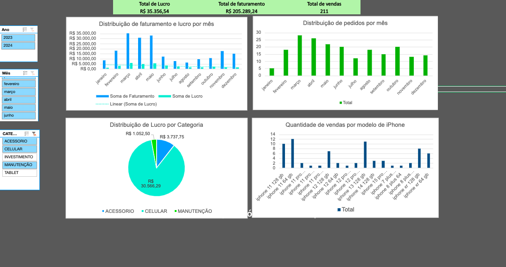

# Dashboard de Análise de Empreendimento

Este repositório contém a dashboard interativa do meu empreendimento, construída usando o Excel. A dashboard apresenta uma visão geral das métricas e dados-chave do meu negócio, permitindo uma análise aprofundada e decisões informadas.

## Descrição do Projeto

A dashboard foi criada utilizando dados do Excel, com gráficos interativos e filtros dinâmicos que permitem explorar as informações de maneira eficiente. Ela inclui as seguintes seções:

- **Visão Geral**: Apresenta um resumo dos dados mais importantes.
- **Vendas**: Detalha as vendas por período, produto e região.
- **Desempenho**: Análise do desempenho do empreendimento ao longo do tempo.
- **Análise Financeira**: Exibe a evolução de receitas e despesas.

## Como Acessar a Dashboard

1. **Veja o resultado**:
   Clique no link abaixo para baixar ver a Dashbord e planilhas:
   
   [Excel Online](https://onedrive.live.com/personal/bc9cb59388db11f6/_layouts/15/Doc.aspx?sourcedoc=%7Bd093c666-cde2-4cd0-86e9-5027ea4b8627%7D&action=default&redeem=aHR0cHM6Ly8xZHJ2Lm1zL3gvYy9iYzljYjU5Mzg4ZGIxMWY2L0VXYkdrOURpemRCTWh1bFFKLXBMaGljQkhuakxoRmNBc1dqYV95eFVMa2xOc1E_ZT1pMmJhNzU&slrid=22f37ba1-2015-7000-c0c9-bf695a2153d2&originalPath=aHR0cHM6Ly8xZHJ2Lm1zL3gvYy9iYzljYjU5Mzg4ZGIxMWY2L0VXYkdrOURpemRCTWh1bFFKLXBMaGljQkhuakxoRmNBc1dqYV95eFVMa2xOc1E_cnRpbWU9WmZSc201d18zVWc&CID=5a4a970b-51f9-4bef-b9ae-1bb74a8c317c&_SRM=0:G:48)

Aqui está uma captura da dashboard:

2. **Abrir no Excel**:
   Abra o arquivo no Microsoft Excel ou em outro programa de planilha compatível (como o Google Sheets, embora algumas funcionalidades interativas possam não funcionar adequadamente lá).

3. **Explorar os gráficos interativos**:
   Após abrir o arquivo, você pode explorar os gráficos e utilizar os filtros para visualizar diferentes períodos, categorias de produto e regiões.

## Como Utilizar a Dashboard

- **Filtro de Período**: Utilize o filtro para selecionar o período desejado e visualizar os dados relacionados.
- **Segmentação de Dados**: Ajuste os filtros para ver informações específicas sobre vendas, produtos ou desempenho.
- **Interatividade**: Todos os gráficos são interativos e atualizarão automaticamente os dados com base nas suas seleções.

## Tecnologias Usadas

- **Microsoft Excel**: Para criar a dashboard com gráficos, tabelas dinâmicas e filtros.
- **Fórmulas e Funções**: Usadas para calcular métricas chave e atualizar os dados em tempo real.

## Contribuições

Se você tiver sugestões ou melhorias para a dashboard, fique à vontade para abrir uma issue ou fazer um pull request!

